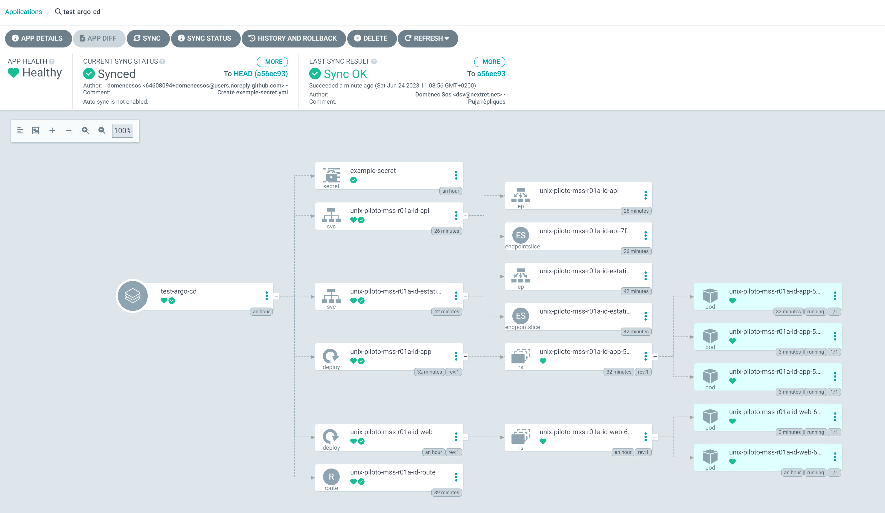
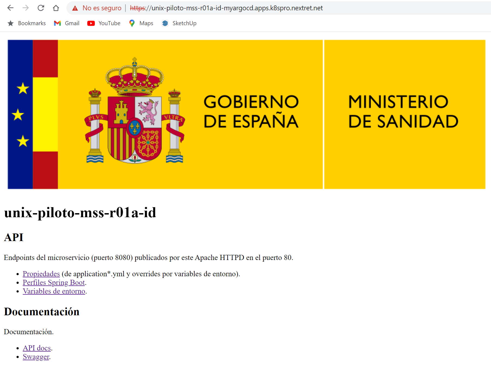
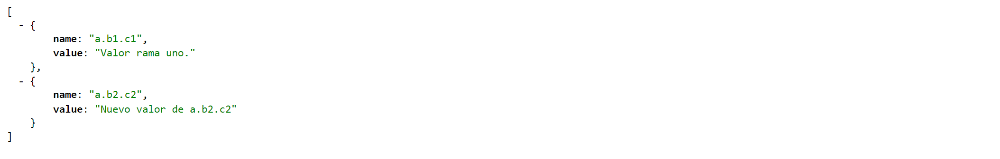

# argocd-sample-app

Aplicación ejemplo compuesta por una API en SpringBoot y un site estático

Cada uno de los dos modulos copia el artefacto generado en `target` al directorio común `docker/nexus`, cambiando el nombre del artefacto pero incluyendo la versión.

## Preparación y verificación en local de las imágenes

### Construcción Maven

Disponer de Maven y Java 8 en la línea de comandos.

Ejecutar [100-mvnBuild.bat](100-mvnBuild.bat).

El script borra el directorio de docker/nexus y a continuación hace un `mvn clean package` del proyecto padre.

Al final de la construcción del \*.jar de SpringBoot este se copia en el directorio de desplegables.
```
[INFO] Building UnixPilotoMssR01aIdApp 0.0.1-SNAPSHOT                     [1/3]
(...)
[INFO] --- maven-jar-plugin:3.2.2:jar (default-jar) @ unix-piloto-mss-r01a-id-app ---
[INFO] Building jar: C:\_exe\E31710\Fuentes\AppPrueba\argocd-sample-app\unix-piloto-mss-r01a-idApp\target\unix-piloto-mss-r01a-id-app-0.0.1-SNAPSHOT.jar
[INFO] --- spring-boot-maven-plugin:2.7.12:repackage (repackage) @ unix-piloto-mss-r01a-id-app ---
[INFO] Replacing main artifact with repackaged archive
[INFO] --- copy-rename-maven-plugin:1.0:copy (copy-file) @ unix-piloto-mss-r01a-id-app ---
[INFO] Copied C:\_exe\E31710\Fuentes\AppPrueba\argocd-sample-app\unix-piloto-mss-r01a-idApp\target\unix-piloto-mss-r01a-id-app-0.0.1-SNAPSHOT.jar to C:\_exe\E31710\Fuentes\AppPrueba\argocd-sample-app\unix-piloto-mss-r01a-idApp\..\docker/nexus\unix-springboot-0.0.1-SNAPSHOT.jar
```

La aplicación web genera un \*.jar vacío sin utilidad.
Interesa el assembly del contenido web (configurado en tres formatos comprimidos a la vez, elegir el preferido).
Finalmente se copia un comprimido en el directorio de `docker/nexus`.
```
[INFO] -------< es.gob.sanidad.piloto.k8s:unix-piloto-mss-r01a-id-web >--------
[INFO] Building UnixPilotoMssR01aIdWeb 0.0.1-SNAPSHOT                     [3/3]
(...)
[INFO] --- maven-assembly-plugin:3.3.0:single (create-archive) @ unix-piloto-mss-r01a-id-web ---
[INFO] Reading assembly descriptor: C:\_exe\E31710\Fuentes\AppPrueba\argocd-sample-app\unix-piloto-mss-r01a-idWeb/src/assembly/dep.xml
[INFO] Building tar: C:\_exe\E31710\Fuentes\AppPrueba\argocd-sample-app\unix-piloto-mss-r01a-idWeb\target\unix-piloto-mss-r01a-id-web-0.0.1-SNAPSHOT-estaticos.tar.gz
[INFO] Building tar: C:\_exe\E31710\Fuentes\AppPrueba\argocd-sample-app\unix-piloto-mss-r01a-idWeb\target\unix-piloto-mss-r01a-id-web-0.0.1-SNAPSHOT-estaticos.tar.bz2
[INFO] Building zip: C:\_exe\E31710\Fuentes\AppPrueba\argocd-sample-app\unix-piloto-mss-r01a-idWeb\target\unix-piloto-mss-r01a-id-web-0.0.1-SNAPSHOT-estaticos.zip
[INFO]
[INFO] --- copy-rename-maven-plugin:1.0:copy (copy-file) @ unix-piloto-mss-r01a-id-web ---
[INFO] Copied C:\_exe\E31710\Fuentes\AppPrueba\argocd-sample-app\unix-piloto-mss-r01a-idWeb\target\unix-piloto-mss-r01a-id-web-0.0.1-SNAPSHOT-estaticos.zip to C:\_exe\E31710\Fuentes\AppPrueba\argocd-sample-app\unix-piloto-mss-r01a-idWeb\..\docker/nexus\unix-estaticos-0.0.1-SNAPSHOT.zip
```
### Construcción de las imágenes

Ejecutar 

- [200-buildSpringBootDockerImage.bat](200-buildSpringBootDockerImage.bat) para construir la imagen Docker de la aplicación SpringBoot.
- [300-buildApacheDockerImage.bat](300-buildApacheDockerImage.bat) para construir la imagen Docker de la web de estáticos.

Ambas imágenes se construyen desde el directorio `docker` donde están los Dockerfile
y para marcar conceptualmente que se deben construir desde Nexus
usan los artefactos en el directorio `docker/nexus`,
no los artefactos del directorio `target` de la aplicación.

#### Test unitario de las imágenes

Con [210-testSpringBootDockerImage.bat](210-testSpringBootDockerImage.bat) y 
[211-stopTestSpringBootDockerImage.bat](211-stopTestSpringBootDockerImage.bat) se puede validar el funcionamiento de la API en solitario.
Dejar que arranque la API y entonces recargar Swagger en el navegador que se abre.

Para probar la imagen del servidor web
```
docker run -d -p 80:80 --name unix-piloto-mss-r01a-id-web unix-piloto-mss-r01a-id/unix-piloto-mss-r01a-id-web
```
Abrir http://localhost/ 
Al acabar:
```
docker stop unix-piloto-mss-r01a-id-web
docker rm   unix-piloto-mss-r01a-id-web
```

#### Preparación de las imágenes

Obtener la config inicial de Apache, adaptando a la imagen que se use
```
docker run --rm httpd:2.4 cat /usr/local/apache2/conf/httpd.conf > unix-piloto-mss-r01a-id-httpd.conf
```
Reescribir la configuración de Apache obtenida añadiendo estas líneas en el sitio correspondiente a cada bloque
```
LoadModule proxy_module modules/mod_proxy.so
LoadModule proxy_http_module modules/mod_proxy_http.so

<IfModule proxy_module>
	ProxyPass "/api"  "http://unix-piloto-mss-r01a-id-api:8080/api/"
 	ProxyPassReverse "/api"  "http://unix-piloto-mss-r01a-id-api:8080/api/"
</IfModule>
```
### Validar como Docker compose

Con [400-runDockerCompose.bat](400-runDockerCompose.bat) y el [docker-compose.yml](docker-compose.yml) 
se puede ejecutar el conjunto de las dos imágenes, donde [http://localhost/](http://localhost/) 
expone la web y permite llamar a la API de la app proxypasada por el puerto 80 
(también se publica por el 8080, por si acaso).

El compose:
```
version: "3"
services:

  unix-piloto-mss-r01a-id-api:
    image: unix-piloto-mss-r01a-id/unix-piloto-mss-r01a-id-app
    container_name: api
    ports:
      - "8080:8080"

  unix-piloto-mss-r01a-id-web:
    image: unix-piloto-mss-r01a-id/unix-piloto-mss-r01a-id-web
    container_name: web
    ports:
      - "80:80"
```
Traza del arranque:
```
Creating network "argocd-sample-app_default" with the default driver
Creating api ... done
Creating web ... done
Attaching to api, web

web                            | AH00558: httpd: Could not reliably determine the server's fully qualified domain name, using 172.31.0.3. Set the 'ServerName' directive globally to suppress this message
web                            | AH00558: httpd: Could not reliably determine the server's fully qualified domain name, using 172.31.0.3. Set the 'ServerName' directive globally to suppress this message
web                            | [Fri Jun 23 13:35:15.179769 2023] [mpm_event:notice] [pid 1:tid 139663550586176] AH00489: Apache/2.4.57 (Unix) configured -- resuming normal operations
web                            | [Fri Jun 23 13:35:15.180043 2023] [core:notice] [pid 1:tid 139663550586176] AH00094: Command line: 'httpd -D FOREGROUND'

api                            |
api                            |   .   ____          _            __ _ _
api                            |  /\\ / ___'_ __ _ _(_)_ __  __ _ \ \ \ \
api                            | ( ( )\___ | '_ | '_| | '_ \/ _` | \ \ \ \
api                            |  \\/  ___)| |_)| | | | | || (_| |  ) ) ) )
api                            |   '  |____| .__|_| |_|_| |_\__, | / / / /
api                            |  =========|_|==============|___/=/_/_/_/
api                            |  :: Spring Boot ::               (v2.7.12)
api                            |
api                            | 2023-06-23 15:35:16.985  INFO 1 --- [           main] g.s.p.k.u.UnixPilotoMssR01aIdApplication : Starting UnixPilotoMssR01aIdApplication v0.0.1-SNAPSHOT using Java 1.8.0_212 on ab6d094f614a with PID 1 (/app.jar started by spring in /)
api                            | 2023-06-23 15:35:16.991  INFO 1 --- [           main] g.s.p.k.u.UnixPilotoMssR01aIdApplication : No active profile set, falling back to 1 default profile: "default"
api                            | 2023-06-23 15:35:19.265  INFO 1 --- [           main] o.s.b.w.embedded.tomcat.TomcatWebServer  : Tomcat initialized with port(s): 8080 (http)
api                            | 2023-06-23 15:35:19.308  INFO 1 --- [           main] o.apache.catalina.core.StandardService   : Starting service [Tomcat]
api                            | 2023-06-23 15:35:19.308  INFO 1 --- [           main] org.apache.catalina.core.StandardEngine  : Starting Servlet engine: [Apache Tomcat/9.0.75]
api                            | 2023-06-23 15:35:19.491  INFO 1 --- [           main] o.a.c.c.C.[Tomcat].[localhost].[/api]    : Initializing Spring embedded WebApplicationContext
api                            | 2023-06-23 15:35:19.491  INFO 1 --- [           main] w.s.c.ServletWebServerApplicationContext : Root WebApplicationContext: initialization completed in 2352 ms
api                            | 2023-06-23 15:35:20.300  INFO 1 --- [           main] pertySourcedRequestMappingHandlerMapping : Mapped URL path [/v2/api-docs] onto method [springfox.documentation.swagger2.web.Swagger2Controller#getDocumentation(String, HttpServletRequest)]
api                            | 2023-06-23 15:35:20.891  INFO 1 --- [           main] o.s.b.w.embedded.tomcat.TomcatWebServer  : Tomcat started on port(s): 8080 (http) with context path '/api'
api                            | 2023-06-23 15:35:20.893  INFO 1 --- [           main] d.s.w.p.DocumentationPluginsBootstrapper : Context refreshed
api                            | 2023-06-23 15:35:20.926  INFO 1 --- [           main] d.s.w.p.DocumentationPluginsBootstrapper : Found 1 custom documentation plugin(s)
api                            | 2023-06-23 15:35:20.984  INFO 1 --- [           main] s.d.s.w.s.ApiListingReferenceScanner     : Scanning for api listing references
api                            | 2023-06-23 15:35:21.202  INFO 1 --- [           main] g.s.p.k.u.UnixPilotoMssR01aIdApplication : Started UnixPilotoMssR01aIdApplication in 5.252 seconds (JVM running for 6.153)
```

### Subida al repositorio de imagenes

Se encarga [500-pushDockerImages.bat](500-pushDockerImages.bat).

El repositorios está definido en una variable de entorno `%REPOSITORIO%`. Ajsutar al repositorio disponible.

## Despliegue en Openshift

### Aplicación web

Lo fundamental es desplegar la imagen exponiendo el puerto TCP.
- Este servidor web expone el puerto 80.
- Usa la imagen `jobs.rtve.local:5000/unix-piloto-mss-r01a-id-web:latest` abada de "pushar".
- El nombre del despliegue y el de la aplicación OpenShift (`app`) asociada `unix-piloto-mss-r01a-id-web` coinciden con el de la imagen por simple comodidad.
```
apiVersion: apps/v1
kind: Deployment
metadata:
  namespace: unix-piloto
  name: 'unix-piloto-mss-r01a-id-web'
spec:
  selector:
    matchLabels:
      app: unix-piloto-mss-r01a-id-web
  replicas: 1
  template:
    metadata:
      labels:
        app: unix-piloto-mss-r01a-id-web
    spec:
      containers:
        - name: container
          image: >-
            jobs.rtve.local:5000/unix-piloto-mss-r01a-id-web:latest
          ports:
            - containerPort: 80
              protocol: TCP
  strategy:
    type: RollingUpdate
    rollingUpdate:
      maxSurge: 25%
      maxUnavailable: 25%
```
El servicio le da un nombre de DNS en la red interna del cluster y lo hace accesible en esta red.
En este caso, `unix-piloto-mss-r01a-id-estaticos.unix-piloto.svc.cluster.local` 
formado por el nombre del servicio, el namespace `unix-piloto` y el sufijo `svc.cluster.local` que lo restringe al clúster local.
Se transmite de forma directa el puerto 80 para tráfico HTTP en limpio.
```
apiVersion: v1
kind: Service
metadata:
  name: unix-piloto-mss-r01a-id-estaticos
  namespace: unix-piloto
spec:
  selector:
    app: unix-piloto-mss-r01a-id-web
  ports:
    - protocol: TCP
      port: 80
      targetPort: 80
```
La ruta (mejor que un ingress) permite exponer el servicio fuera del clúster.
- El nombre indica que es una ruta, por donde pasaran las peticiones al Apache tanto de estáticos como de proxy a la API.
- En `spec.to.name` se engancha con el servicio anterior (nombre en corto, mismo namespace).
- En `spec.tls` se define:
	- Una terminación perimetral `termination: edge` dejando que sea la ruta el límite del tráfico seguro.
	- Se redirecciona el tráfico HTTP a HTTPS con `insecureEdgeTerminationPolicy: Redirect`.
	- se podrían dar los certificados de las CA para el tráfico seguro.
- El `spec.host` puede ser cualquier valor:
	- La parte `unix-piloto-mss-r01a-id` es arbitraria pero significativa.
	- El sufijo `.apps.k8spro.nextret.net` va a parar a la IP donde los nombres de `spec.host` se interpretan de forma similar a los virtual host.
 
```
kind: Route
apiVersion: route.openshift.io/v1
metadata:
  name: unix-piloto-mss-r01a-id-route
  namespace: unix-piloto
  labels: {}
spec:
  to:
    kind: Service
    name: unix-piloto-mss-r01a-id-estaticos
  tls:
    termination: edge
    insecureEdgeTerminationPolicy: Redirect
    destinationCACertificate: ''
  host: unix-piloto-mss-r01a-id.apps.k8spro.nextret.net
  path: /
  port:
    targetPort: 80
```
#### Troubleshooting
- La imagen de Apache permite hacer un `apt-get update` y `apt install wget` para probar un wget `http://localhost`
- Desde otro contenedor que disponga también de `wget`, validar que resuelve el nombre con `ping unix-piloto-mss-r01a-id-estaticos` y luego un `wget http://unix-piloto-mss-r01a-id-estaticos`

### Despliegue de la API
El despliegue de la API será similar con las particularidades de:
- Ausencia de ruta ya que se hará un proxy pass por la propia web.
- El nombre del servicio será `unix-piloto-mss-r01a-id-api` para encajar con la definición del proxy pass en el `unix-piloto-mss-r01a-id-httpd.conf` que se ha metido en la imagen de Apache.
```
	ProxyPass "/api"  "http://unix-piloto-mss-r01a-id-api:8080/api/"
 	ProxyPassReverse "/api"  "http://unix-piloto-mss-r01a-id-api:8080/api/"
```
El despliegue de la imagen:
```
apiVersion: apps/v1
kind: Deployment
metadata:
  namespace: unix-piloto
  name: 'unix-piloto-mss-r01a-id-app'
spec:
  selector:
    matchLabels:
      app: unix-piloto-mss-r01a-id-app
  replicas: 1
  template:
    metadata:
      labels:
        app: unix-piloto-mss-r01a-id-app
    spec:
      containers:
        - name: container
          image: >-
            jobs.rtve.local:5000/unix-piloto-mss-r01a-id-app:latest
          ports:
            - containerPort: 8080
              protocol: TCP
          env:
            - name: A_B2_C2
              value: Nuevo valor de a.b2.c2
  strategy:
    type: RollingUpdate
    rollingUpdate:
      maxSurge: 25%
      maxUnavailable: 25%
```
El servicio proxy-pass-friendly:
```
apiVersion: v1
kind: Service
metadata:
  name: unix-piloto-mss-r01a-id-api
  namespace: unix-piloto
spec:
  selector:
    app: unix-piloto-mss-r01a-id-app
  ports:
    - protocol: TCP
      port: 8080
      targetPort: 8080
```
Y la variable de entorno `A_B2_C2` que redefine la propiedad `a.b2.c2` del `application.yml` con `Otro valor rama dos.`
como se ve en [https://unix-piloto-mss-r01a-id.apps.k8spro.nextret.net/api/props](https://unix-piloto-mss-r01a-id.apps.k8spro.nextret.net/api/props).

Nótese que se accede a la API por el puerto 80 de la ruta, que va al servicio de Apache, que proxy-pasa al servicio de la API.
```
[
	{
		name: "a.b1.c1",
		value: "Valor rama uno."
	},
	{
		name: "a.b2.c2",
		value: "Otro valor rama dos."
	}
]
```
## Despliegue con ArgoCD

Usaremos el repositorio [https://github.com/domenecsos/argocd-vault-plugin-test](https://github.com/domenecsos/argocd-vault-plugin-test) 
donde de momento hay un secreto `example-secret.yml` en espera de culminar la prueba de concepto de Vault.

```
kind: Secret
apiVersion: v1
metadata:
  name: example-secret
  annotations:
    avp.kubernetes.io/path: "avp/data/test"
type: Opaque
stringData:
  sample-secret: <sample>
```
Accedemos a la consola de ArgoCD y creamos una nueva aplicación que expresada en YAML queda así.
```
apiVersion: argoproj.io/v1alpha1
kind: Application
metadata:
  name: test-argo-cd
spec:
  destination:
    name: ''
    namespace: myargocd
    server: 'https://kubernetes.default.svc'
  source:
    path: .
    repoURL: 'https://github.com/domenecsos/argocd-vault-plugin-test/'
    targetRevision: HEAD
  sources: []
  project: avpluginproj
```
**Importante**
> Todo esto queda sujeto a completar 
> 1) la prueba de concepto de Vault para que el secreto anterior tome su valor de Vault, y 
> 2) la configuración final de la instancia de Argo CD según una lista de criterios.

El contenido de este repositorio git no tiene secreto: 
Son los manifiestos que anteriormente se han creado a mano en el namespace `unix-piloto`.
Por motivos de configuración temporal de ArgoCD, esta aplicación despliega al namespace `myargocd`
(ver el YAML de la definición de la aplicación).

En consecuencia, los cambios a aplicar al crear un fichero para cada manifiesto son:
- Eliminar el `namespace: unix-piloto` de **todos** los manifiestos y dejar que sea ArgoCD quien maneje el namespace destino según define la aplicación.
- En el caso de la ruta
	- Evitar conflictos y dar un host distinto del ya usado:
		- `host: unix-piloto-mss-r01a-id-myargocd.apps.k8spro.nextret.net`.
		- Quitar `destinationCACertificate: ''` que no se sincroniza por no tener sentido.
- No probar los accesos a la API hasta que esté desplegada para evitar que Apache la de por no disponible.
- De paso, subir la API a 3 réplicas y Apache a 2 réplicas.

El resultado final despliegue luce así.
	

Para llegar a todo verde puede ser necesario resincronizar con `prune` alguna vez.

La homepage de la web:


- Ejemplo de API, propiedades Spring Boot:



	
